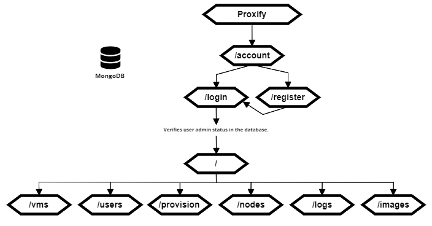
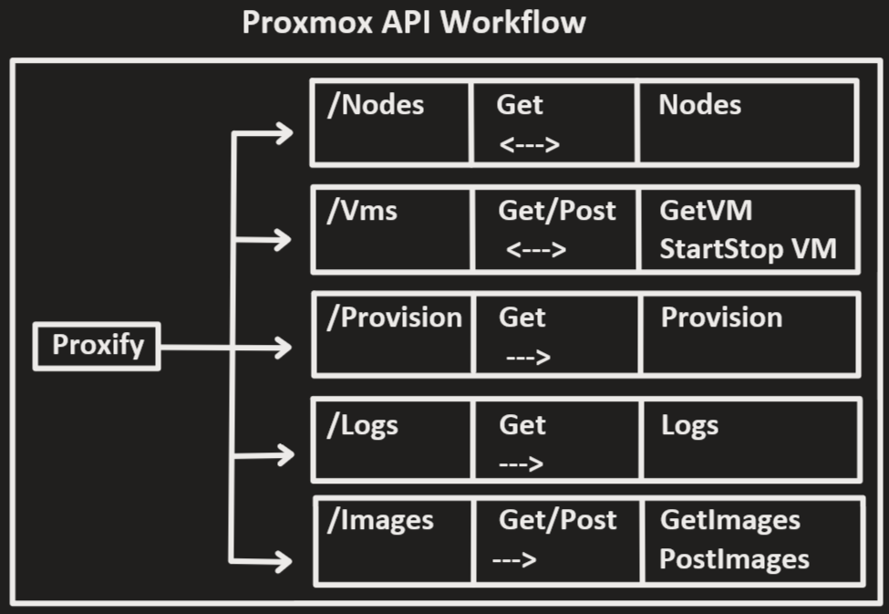

# Proxify 

Welcome to Proxify, a web application developed as part of our studies at Octopus Computer Solutions Bootcamp!

## Technical Overview

Proxify leverages the following technologies:

- **Next.js**: A React framework for building server-side rendered (SSR) and statically generated web applications.
- **React**: A JavaScript library for building user interfaces.
- **Proxmox API**: Proxify interacts with the Proxmox Virtual Environment (PVE) through its RESTful API to manage virtual machines.

## App Diagram

The following diagram illustrates the architecture of the application

 

## API Diagram

The following diagram illustrates the architecture and interaction of Proxify with the Proxmox API:

 

## Features

Proxify offers the following features:

- **Node**: view existing nodes
- **Virtual Machine Management**: Control and monitor virtual machines within the Proxmox environment.
- **Provisioning**: Provision new virtual machines directly from the web interface.
- **Logs**: View and analyze logs for troubleshooting purposes.
- **Image Management**: Manage disk images for virtual machines.

## Installation

To install and run Proxify locally, follow these steps:

1. Clone the repository: `git clone <repository-url>`
2. Navigate to the project directory: `cd proxify`
3. Edit the `next.config.js` variables to match your own
4. Install dependencies: `npm install`
5. Start the development server: `npm run dev`
6. Access the application at `http://localhost:3000`

## Usage

Once the application is running, you can navigate through the user interface to perform various tasks such as viewing nodes, virtual machines, provisioning, viewing logs, and managing images.

## Contributing

Contributions to Proxify are welcome! If you encounter any issues or have suggestions for improvements, please open an issue or submit a pull request on the GitHub repository.
